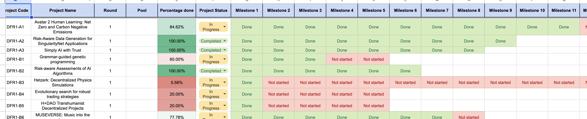

# 📊 **DeepFunding in Numbers**

|                            | DFR1  | DFR2     | DFR3      | DFR4 beta | DFR4     | Total      |
|----------------------------|-------|---------|----------|----------|---------|------------|
| **Total amount available (AGIX)** | $1.0M  | $0.5M   | $1.53M   | $0.265M  | $1.52M  | 4.815      |
| **Total amount awarded (AGIX)** | $741,000 | $449,212 | $1,454,396 | $265,000  | 1,437,735 | $4,347,343 |
| **Nr. of pools**           | 2     | 5       | 5        | 3        | 6       |            |
| **Nr. of submissions**     | 47    | 89      | 139      | 15       | 210     |            |
| **Nr. of eligible projects** | 28  | 57      | 117      | 15       | 192     |            |
| **Nr. of awarded projects** | 12   | 17      | 43       | 9        | 29      |            |
| **Nr. of wallets that voted** | 158 | 187     | 220      |          |         |            |

## __RFPs__

Temporary dashboard with all projects and milestones: [Dashboards (Deprecated)](https://docs.google.com/spreadsheets/d/1NW0QITt2VNNbeKjWcymH8lnycYwyLGC7dB_AfZqrzIA/edit?usp=sharing){ data-preview }

Fragment:

**All awarded projects** including all available details can be found on the portal: [awarded projects](https://deepfunding.ai/projects-and-proposals/?tab=awarded-project-tab){ data-preview }

Blogs with some analytic review on the voting process in each round:

## __DFR1__

- https://deepfunding.ai/deep-funding-round-1-voting-analysis-part-1-number-crunching/ 

- https://deepfunding.ai/deep-funding-round-1-voting-analysis-part-2/ 

## __DFR2__

- https://deepfunding.ai/round-2-voting-analysis/ 

## __DFR3__

- https://deepfunding.ai/dfr3-analysis-of-the-results/ 