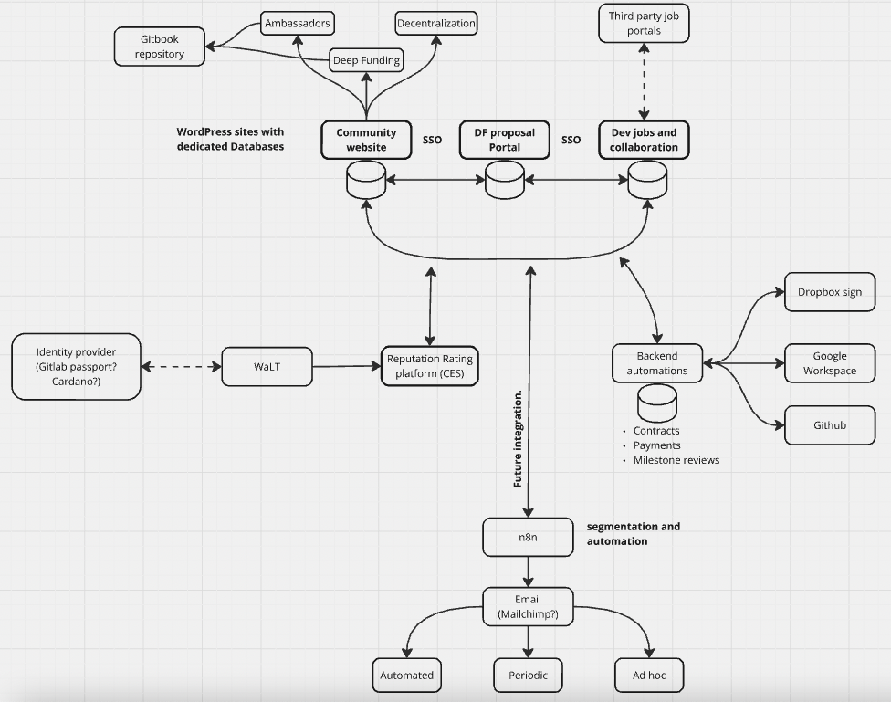

# **Architecture - Vision**

For the 3 portals, we are aiming for a ‘loosely coupled’ architecture that allows each of the sites to collect, enrich, and use data in a common shared source, without creating dependencies. The details need to be refined. Currently, the WP sites are still independent. see diagram for a general envisioned setup, including some backend automation.

