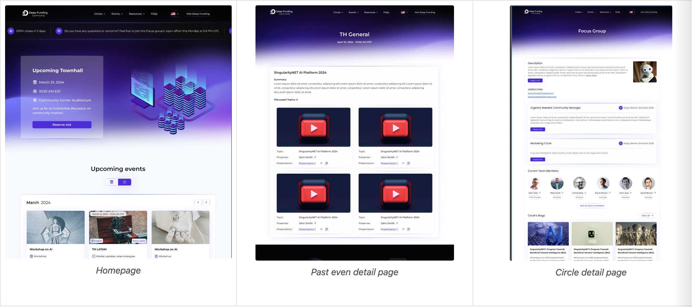

Main features:

- Event calendar, including central town halls, open all hands, Latam town halls, and other (future) regional town halls, hackathons, etc.

    - Option to reserve a presentation slot in a future townhall

    - View past townhalls and their recordings

- News, short announcements, and more elaborate

- Information on each circle, its members, and any updates

- Recruitment form for new circle members

- Blogs, future option for each circle to create their own blogs independently

- (future) sections for cross-circle, temporary workgroups.

