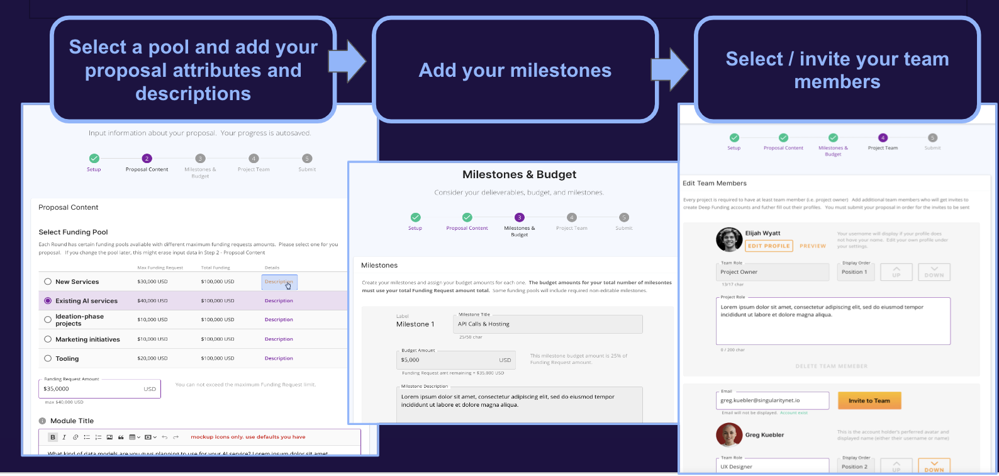
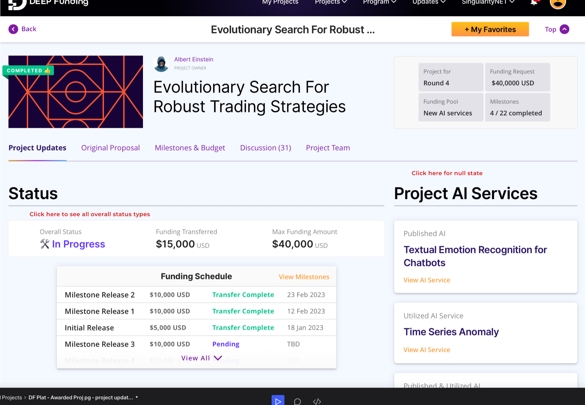
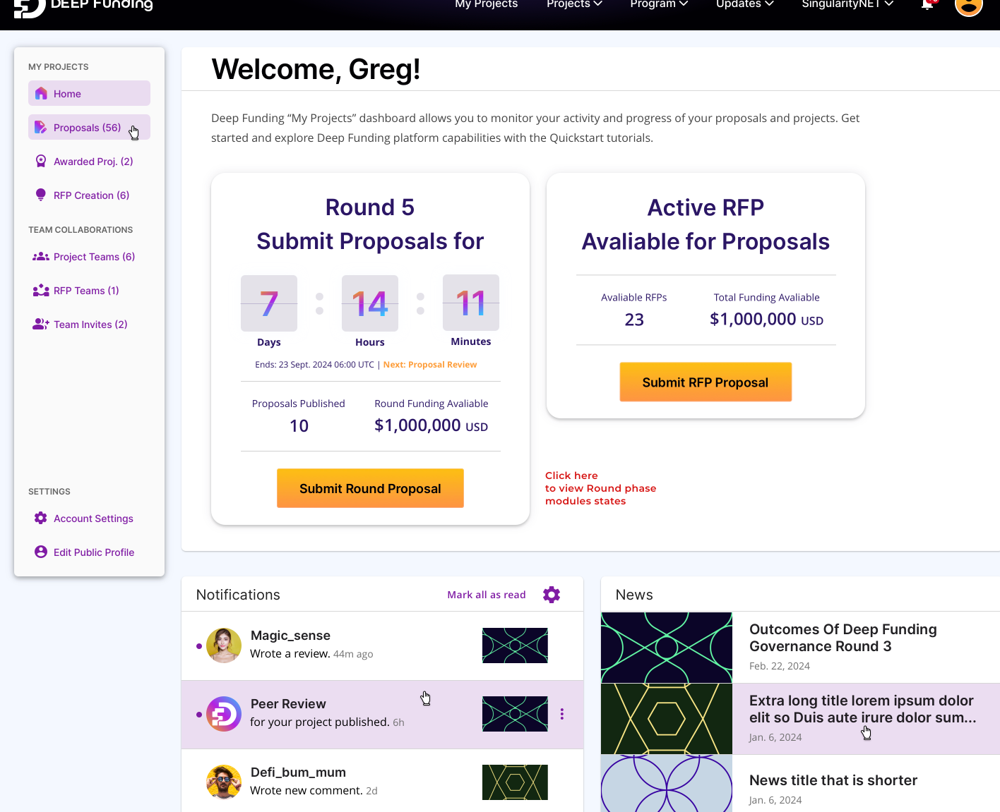
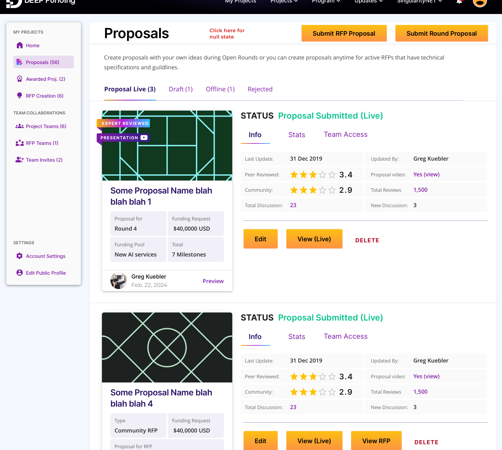
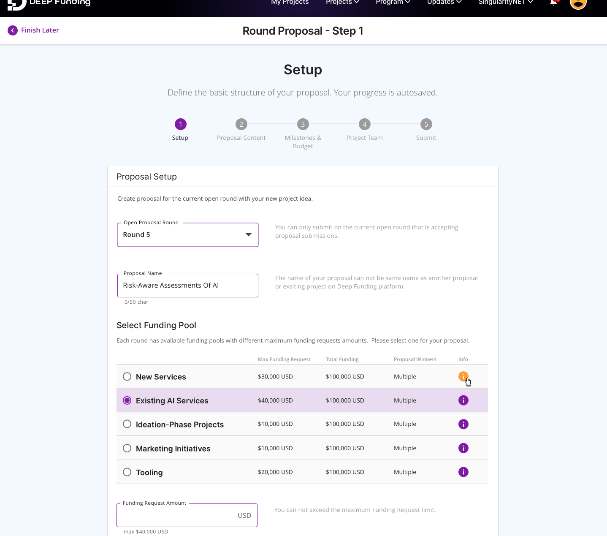

The main Deep Funding platform is an in-house built platform based on WordPress CMS, and developed by an internal team of 2 developers and a part-time UX lead. 
It is a successor of [Swae.io](https://swae.io/), a third-party platform we started out with. Sadly they could not keep up with the speed of development we needed, due to lack of funding. 
We already started building a frontend for DF with some content from Swae in early 2023. This made the decision easier to go full force on our own platform. In Q1 2024 we successfully launched the first ‘Beta’ round on the new platform. This blog, published on the last day of 2023 gives an overview of the features of this portal: [Platform Roadmap 2024 – Status And Outlook](https://deepfunding.ai/platform-roadmap-2024-status-and-outlook/)

This image illustrates the main steps in creating a proposal

Smore more screenshots of the Project detail page, the new 'My Projects' dashboard, and the proposal creation flow. 

*Project details - awarded project*:

*My projects dashboard - on load*:

*My projects dashboard - proposals*:

*Step 1 - proposal creation flow*:
