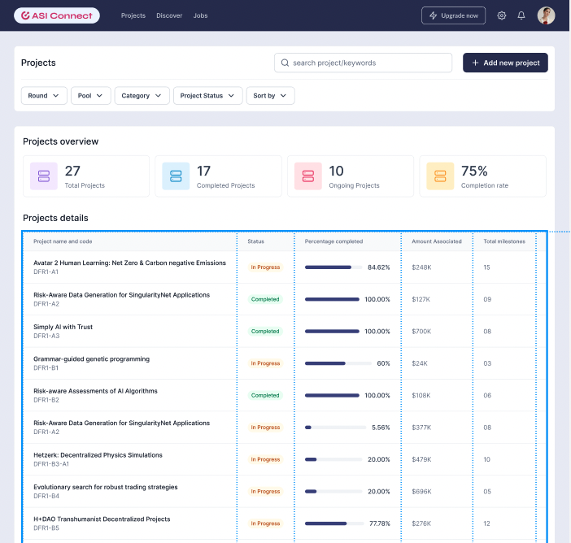
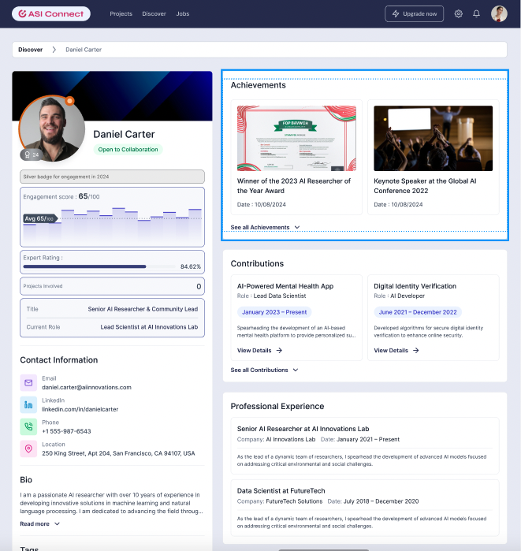
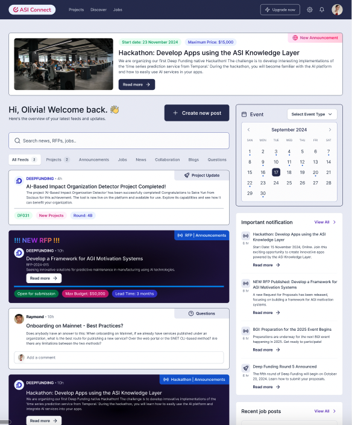
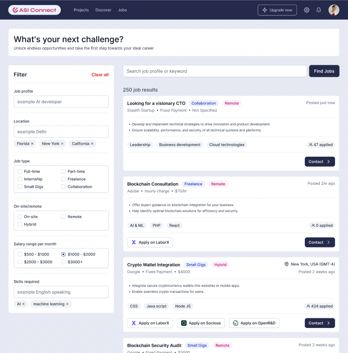

# **Developers.deepfunding.AI or ASI Connect**

This is being explored, but not yet in the building Phase.

We started out with the idea of creating a ‘job portal for DF and the wider SNET/AI community, but we are now gravitating more towards a professional social network, that will include job offers but is mainly targeted at collaboration and communication. Think of it as a 'LinkedIn for DF’ growing to include the SNET ecosystem and ASI community). Unlike the other websites, this will likely not be done in any CMS, to ensure scalability and support multichannel (incl. mobile) frontends. The idea is to create one or multiple well-defined RFPs for the building phase and have the community offer proposals. 

The main purpose of the platform is collaboration and community building. The rich profiles are user-controlled and give insight into all the activities of community members in and around the ecosystem. This is both a source of reputation scores and a representation of someone’s reputation. We believe these rich profiles will help us in the governance layer of DF, in case of voting events, and perhaps also in a wider context, such as SingularityNET votes.  It is important to note that based on this rich profile data multiple ‘Reputation scores’ can be calculated. One could have a rating for expertise (per domain?), a contribution score, a score for alignment and ethical behavior, etc. More about this topic is offered further below under https://singularitynet.atlassian.net/wiki/spaces/DF/pages/edit-v2/498270216#Reputation-platform  

This project is in its earliest phase. Some initial **very conceptual** screens: (don’t pay too much attention to individual components and the exact nature of the content)

*Project Dashboard with Search & Filter*

*A concept of an (extremely well-filled) profile page. This would go hand in hand with the reputation model*

*Example of a global news feed, with multiple types of structured content (Jobs, ideas, project updates, DF announcements, new RFPS, etc.)*

*Job Listing Page*

Main documents: 

- The screens above should be based on actual data. This spreadsheet offers an extensive overview of all current and future data in the system: 
[DF - Project and profile  data - Collaboration portal](https://docs.google.com/spreadsheets/d/1CmWtt5zgN8nld3K_BOd0M142EAzm9bl9bBnSsa8cV-I/edit?gid=142406627#gid=142406627)

- Figma designs: [Figma](https://www.figma.com/design/nCYvBp3aggwZzY9v0ecLXF/DF-Project-%26-Profile-Collab?node-id=2-2&t=m70DKb9qkTs9Opy0-0) PW on request