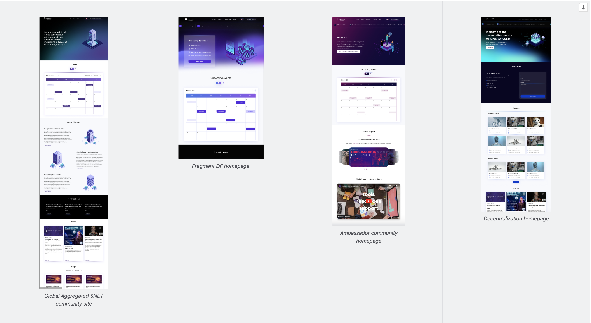

This site is still in development at the moment of writing. The community environment is a multisite system that will consist of 3 subsites, 2 of which are not part of DF

1. Deep Funding (sub)site

2. Ambassadors (sub)site

3. Decentralization (sub)site

4. Aggregate site on SNET level

All sites are built up reusing many shared components. This enables us to aggregate some of the content on a higher level on a global SNET community site, featuring an agenda of *all events* across these 3 domains with proper filtering, high-level information about each domain with links to the subsites, and some selected blogs and news items. 

Screenshots of the 4 environments:
NOTE: we may need to have a look at the colour schemes of each subsite, making each of them more recognizable

