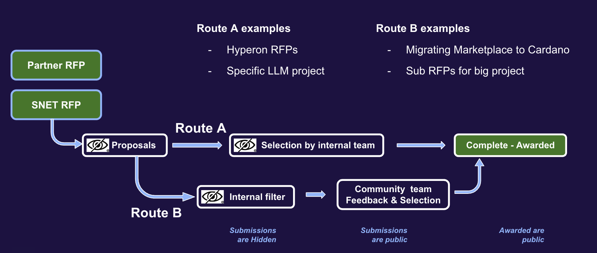
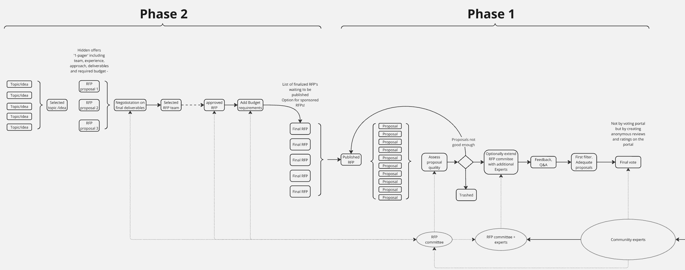
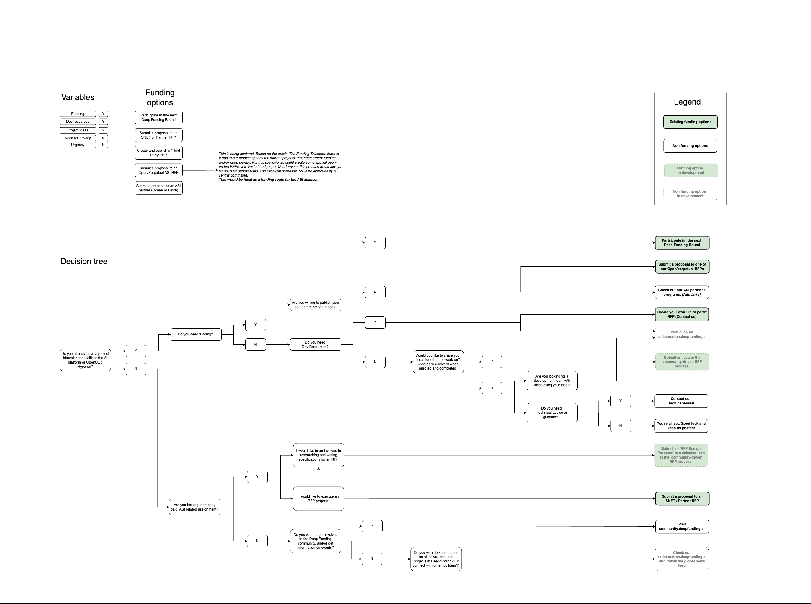

In contrast to ‘DF Rounds’, each RFP has its one custom life cycle. This means that we can expect new RFPs all year round, but probably not equally divided over the year. 
The RFP process is still in development, but the first proposals can be found here: [RFPs - Deepfunding](https://deepfunding.ai/all-rfps/){ data-preview }

We are developing 3 possible flows for RFPs:

*Short and Medium Track*

## **1. Short track**

Best suited for technical projects where the SNET or Partner team is best situated to make a selection of proposals.

**Steps**: The RFP is published - proposals are submitted - at the end of the proposal period the RFP owner selects the winning proposal(s)

## **2. Medium track**

RFPs can be published by SNET of partners, but some community involvement is desired. This will utilize the group of ‘Community Experts’ we are building out.

**Steps**: The RFP is published - proposals are submitted - a shortlist of acceptable proposals is defined by the owner(s) of the RFP - The Community experts will make the final selection. 

## **3. Community-driven RFPs**

Because Flow 2 and 3 are still pretty centralized, we are developing a third flow, where the community is not only involved in creating proposals but also in ideating and creating the RFP itself. Main takeaways:

- We will have an ideation process online where every registered user can contribute

- The RFP ‘Core committee’ will select appropriate and desired ideas. Together with the All Circles, we can make a final selection

- When the idea is selected:

    - A dedicated RFP committee is created from the Experts group

    - An ‘RFP design’ challenge is opened. Anyone can offer a one-pager with a proposal on delivering a full RFP, based on the selected idea. 

- The RFP committee will negotiate on the final proposal, and select a team to start working on the RFP. (Also some runners up will get compensated)

- When the RFP is delivered, the Core committee will allocate the proper funding amounts and publish the RFP

From here on the process will roughly follow the medium track.  
**For details, please read the description of the flow**: [DF- RFP flow 2.0](https://docs.google.com/document/d/1iEfUXcQk4jBUtp4snpxLo34Bf8OsCPQ7-QG06Wbs06Q/edit?usp=sharing){ data-preview }

*Detailed version of the flow: ([View on Miro](https://miro.com/app/board/uXjVK50Qn6E=/?share_link_id=847370195313))*

 Note: The ideation process needs to be a bit more fleshed out and might overlap with functionalities in the collaboration portal.

## **Generic behavior in all flows**:

- Anyone can ask questions on the RFP but only the owner can answer, in public, creating an equal playing field for everyone

- RFPs have the following phases:

    - Pending (RFP is visible, but proposals cannot be submitted yet.)

    - Open for Proposals (with specific end date set, lead time is free to choose per RFP)

    - Internal proposal review (the RFP committee / owner is reviewing the submitted proposals. The proposals remain hidden for the public)

    - Feedback and selection (Medium track - Shortlisted RFPs are public. The experts can ask questions and give their final verdict)

- Proposals will only be visible to the owner of the RFP until the submission period is final. (The submission period can still be re-opened after assessing the first proposals). This is to protect the proposers from copy behavior by their competitors, and will hopefully incentivize them to submit early

## **Main documents**

- RFP creation template and instruction: [DF - RFP - Template V2](https://docs.google.com/document/d/107aaHSitKlz4TEsPX1YP07DJVCg1mlJ3I3sESXE0ZCM/edit?usp=sharing){ data-preview }

**Other routes in consideration**: 

We are (currently) on a trajectory of diversification, in alignment of the insights in this blog: [The funding trilemma - Deepfunding](https://deepfunding.ai/the-funding-trilemma/){ data-preview }

We analyzed there is a gap in our (planned) routes for a specific type of projects / funding needs. Projects that have a brilliant idea, that are under time pressure and may benefit from a less public approach. 

## ‘**Open ended RFPs’ (Name TBD)**

There is the idea of having a kind of lightweight RFP, that has a (yearly?) budget, but no specific deadlines. A dedicated committee will review the incoming proposals regularly, and whenever there is a proposal that stands out and is expected to bring exceptional value, we can award it with some budget. This will offer a kind of ‘fast route’ for brilliant projects that require speed and perhaps less public visibility while in development. The details regarding budget sources, and the make up of this committee etc. are to be determined. Example topics for ‘Open ended RFPs’ can be: 

- OpenCog Hyperon-related projects (Open challenge, very few specific requirements)

- Projects that use or create knowledge nodes on the platform 

- Regional Townhalls (will have more conditions, and open for specific regions until filled)

- Marketing proposals ( general conditions but will be strictly evaluated against added value, measurability etc.) 

## **Funding decision tree**

To clarify all (future) funding options and their target audiences, we created this funding decision tree:

https://singularitynet.atlassian.net/wiki/x/HYAXI 

*see a larger version on https://singularitynet.atlassian.net/wiki/spaces/DF/pages/538411037*