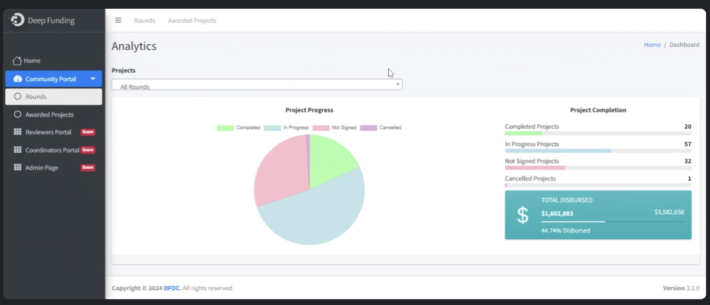
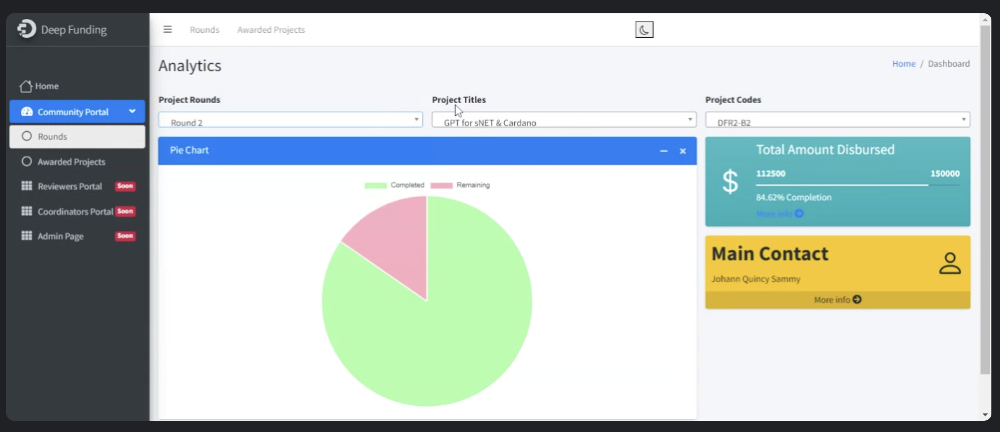
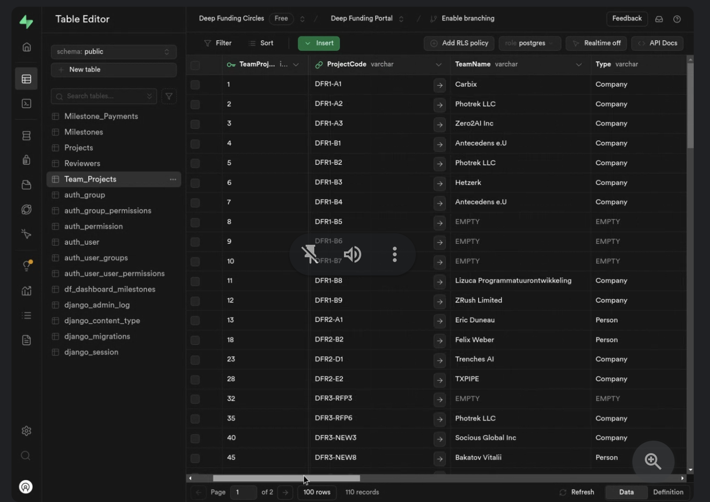

## **Main goals**

- Improve and extend backend automation

- Invest in a high-quality group of Community Experts

- Build a foundational collaboration / professional networking platform

- Build stronger Reputation ratings with multiple dimensions and improve and build out the reputation platform

- Productize WaLT and build in some kind of identification mechanism 

    - (The goal is to identify an actor as a unique human individual in the ecosystem, no other personal data is required)

## **Work in progress on automation**:

Note that also this is being developed by partime, semi-volunteer community members in our **Operation Automation Circle**!

*Round Metrics*

*Project Metrics*

*Postgres Database*

## **Secondary goals**

- Explore alternative voting and reputation mechanisms such as Quadratic voting including ‘strength of opinion’ polling and collation/correlation metrics, supported by the simulation tool

- …