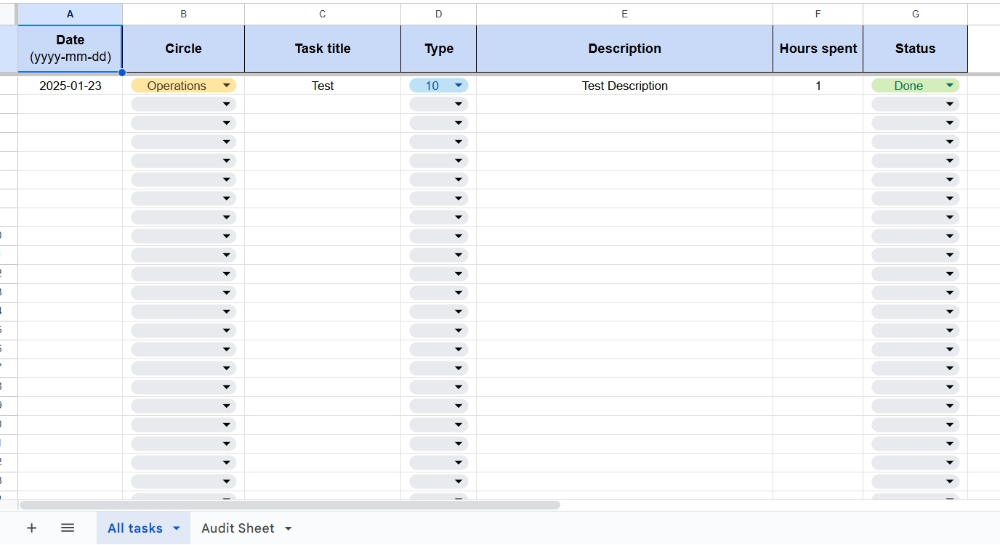
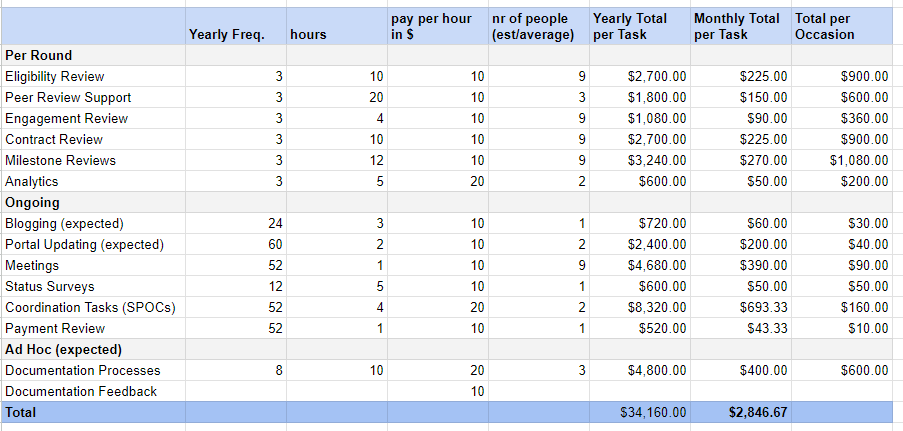

# __Steps for Circle Members__

## __Here are the steps required from Circle members to obtain their payments.__

- Every member has a designated task sheet that will be communicated to them once they have been added to our backend. In case of any delay, please contact the Operations Circle via Mattermost.

__Example of a Task sheet__:

All tasks inputed by the members should be inputed in the "All tasks" tab

- The “type” column indicates if it’s a $20/hr task or $10/hr task. Here is a guide on how to determine the hourly compensation of a task:

__Pay per hour for each type of task__:

- Once a circle member wants to request a payment, they need to contact their coordinator for the rest of the steps to take place.