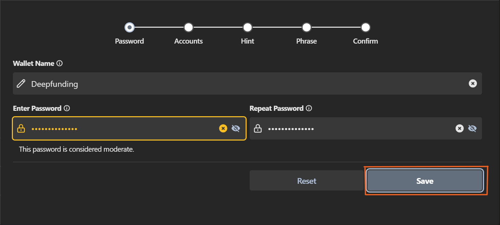
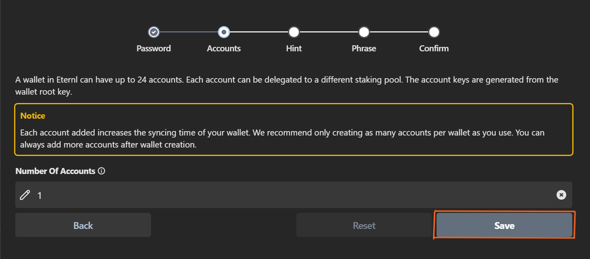
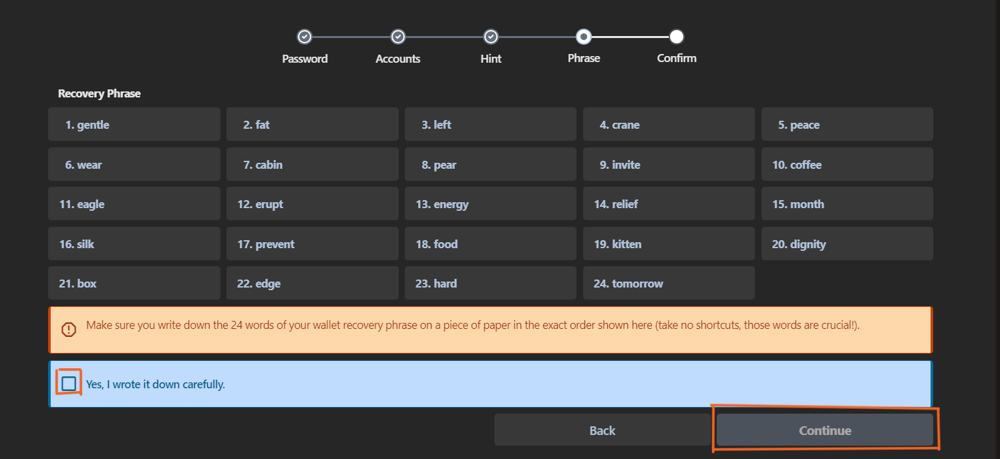

# __Eternl Wallet__

## __Guide for creating a wallet account on Eternl wallet__

- __Download the [Eternl Wallet Extension](https://chromewebstore.google.com/detail/eternl/kmhcihpebfmpgmihbkipmjlmmioameka?hl=en) via the Chrome webstore.__

- __Select “Add wallet”__

__Set a Wallet Name & Password and then select “save”__

__Since you’d likely be creating a single account, select “save”__

- __At this step, you will receive a random set of 24 words, these order of 24 words are your recovery phrase. Make sure to keep the Recovery Phrase in a secret and safe place offline. And then proceed to validate them after accepting that you wrote it down and clicking “continue”. NB: If you lose your recovery phase, you lose the ownership of your wallet.__

- __To receive your $AGIX token, Click the “Recieve” tab and then proceed to copy your recieving wallet address.__

