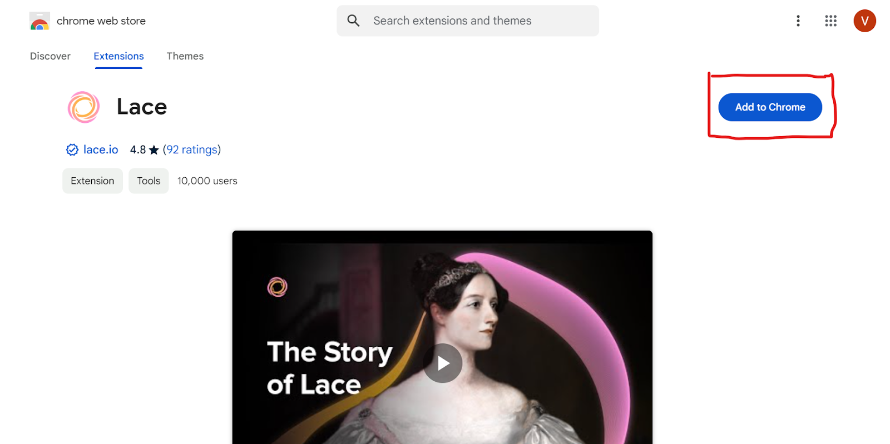
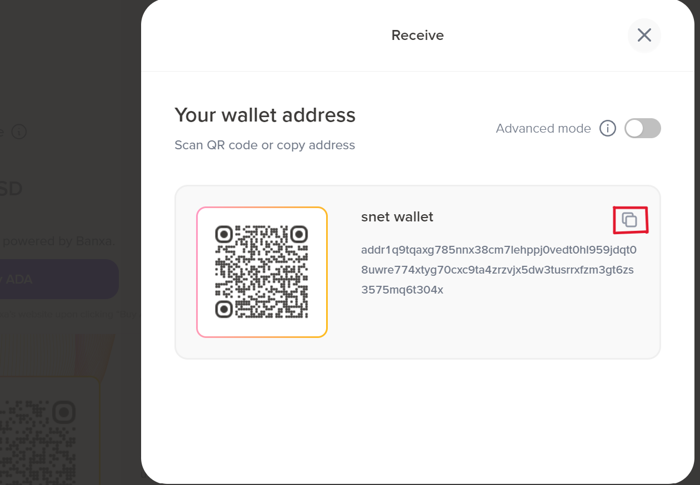

# __Lace Wallet__
## __Guide for creating a wallet account on Lace wallet__

- __Download the [Lace Wallet Extension](https://chromewebstore.google.com/detail/lace/gafhhkghbfjjkeiendhlofajokpaflmk?hl=en) via the Chrome webstore.__

- __Click “Create”__

- __Choose the “Recovery Phrase” method and then click “Next”__

- __At this step, you will receive a random set of 24 words, these order of 24 words are your recovery phrase. Make sure to keep the Recovery Phrase in a secret and safe place offline. And then proceed to validate them. NB: If you lose your recovery phase, you lose the ownership of your wallet.__

- __Set a Wallet Name & Password__

- __To receive your $AGIX token, Click the “Recieve” Button__

- __Proceed to “copy” your wallet address for receiving your payment.__

