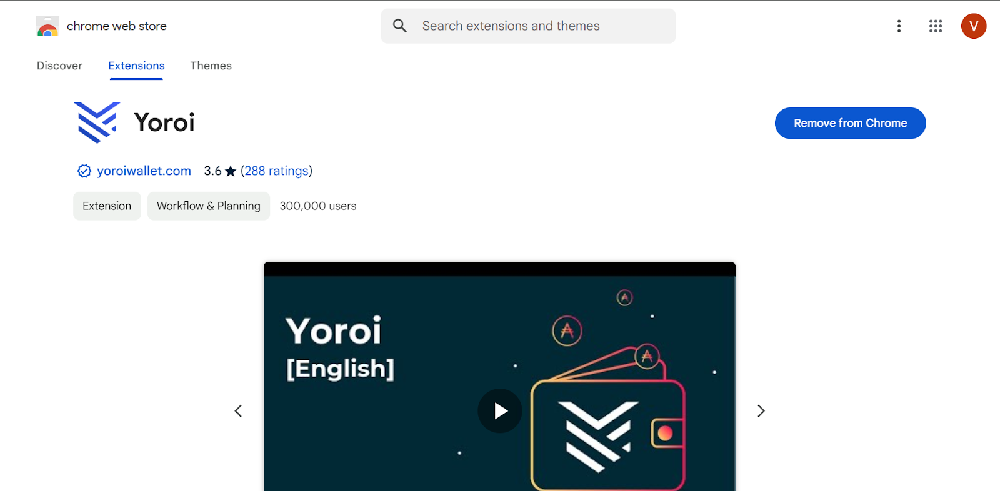
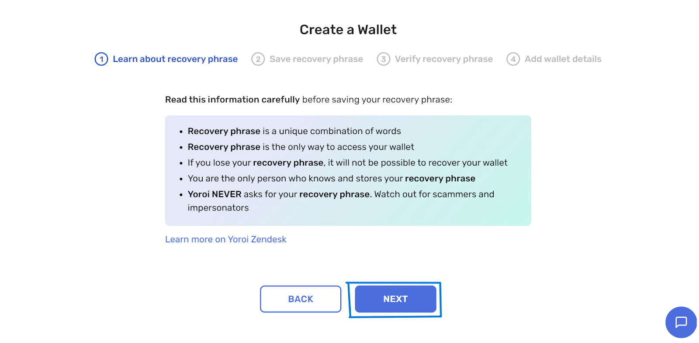

# __Yoroi wallet__

## __Guide for creating a wallet account on Yoroi wallet__

__Download the [Yoroi Wallet Extension](https://chromewebstore.google.com/detail/yoroi/ffnbelfdoeiohenkjibnmadjiehjhajb) via the Chrome webstore.__

__Select your preferred Language and agree with the terms by clicking on the box and then proceed to skip the next steps.__

__Read the instructions carefully before proceeding to click “next”__

__Show your recovery phrase and At this step, you will receive a random set of 24 words, these order of 24 words are your recovery phrase. Make sure to keep the Recovery Phrase in a secret and safe place offline. And then proceed to validate them after clicking “next”. NB: If you lose your recovery phase, you lose the ownership of your wallet.__

__To receive your $AGIX token, Click the “Recieve” tab and then proceed to copy your recieving wallet address.__

